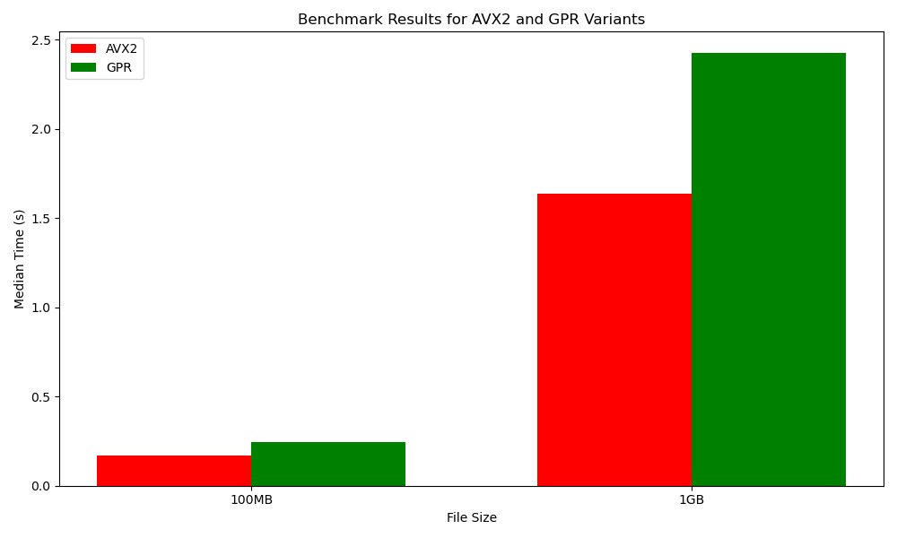

  

# XorCrypt-Asm

  

This program XORs an input file with a key and writes it into an output file, on Linux x64 architecture.

  
  

## Usage

  

Ensure you have an assembler like `nasm` and a linker like `ld` installed and you're running an x64 Linux machine. Virtualbox VM is tested and works too, but there are some problems which are explained below.

  

```bash

make && \

./xorcrypt  data.dat  key.bin  data.out

```

To enable YMM or disable it, comment one of the lines:

```asm

call fn_xor_buf

call fn_xor_buf_ymm

```

  

## How it works

  

The program can be used in 2 modes:

- Byte-by-byte XOR-ing basis

- AVX2 256 bits YMM operations

  

The byte-by-byte, while slower, has a key-wrapping feature, where if the key is smaller than the data file, it will wrap itself around it so it can XOR all the bytes. Also, it works with files that don't divide by 32 bytes.

  

The YMM version is a lot faster (benchmarks below), since it uses vector operations, `vmovqda` but is not yet patched to work with non-divisible sizes.

  

The memory is dynamically allocated using mmap.

## VirtualBox VM Setup

  

To see if your VM has AVX2 enabled:

```bash

cat  /proc/cpuinfo | grep  avx

```

If AVX is enabled, it should return something. Also, make sure your CPU is new enough so it supports AVX2.

  

For me, VirtualBox didn't implement the AVX2 registers (Ryzen 7 5700X), so I had to enter these commands in CMD/Powershell, however I am **not** responsible if this messes up your environment:

* Open CMD/Powershell using admin rights

*  `bcdedit /set hypervisorlaunchtype off`

*  `DISM /Online /Disable-Feature:Microsoft-Hyper-V`

* Restart the PC and it should detect it using `cat /proc/cpuinfo | grep avx`

  

## Benchmark

### Test bench
Ryzen 5 5600U, 32GB RAM, Linux Mint 22 (Host OS)

### Test parameters

The benchmark is made using a python script, that will call `subprocess` for each variant of the XorCrypt, AVX2 and GPR. Test bins are 100MB and 1GB random data from `/dev/urandom`:
```bash
dd if=/dev/urandom of=random_1GB.data bs=1M count=1000 status=progress
```
I tested 10 times for each run and picked the median time, so as not to skew the benchmark with outliers, such as caching the memory inside CPU.



Median times 100MB:
* AVX2 - 0.17s
* GPR - 0.24s

Median times 1GB:
* AVX2 - 1.63s
* GPR - 2.42s

I tested with and without writing to the disk - when just the XOR was performed, without actual writing, the tests were similar, no difference was shown, so some optimizations may have been run by the OS/CPU.
