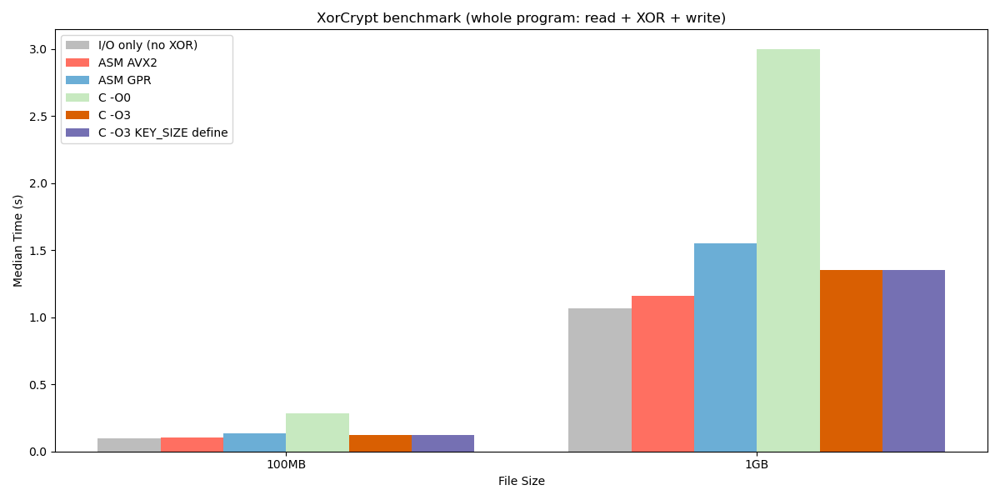
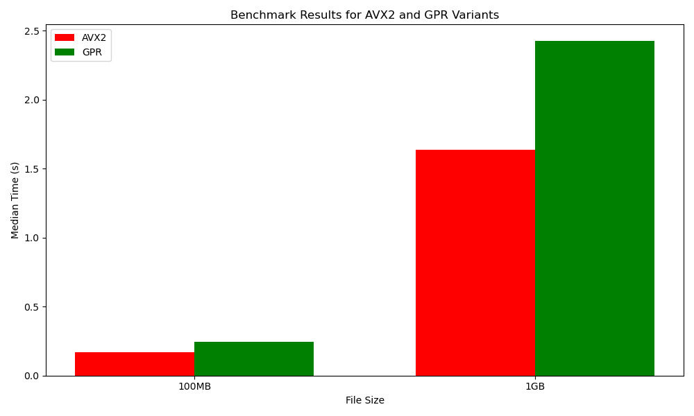
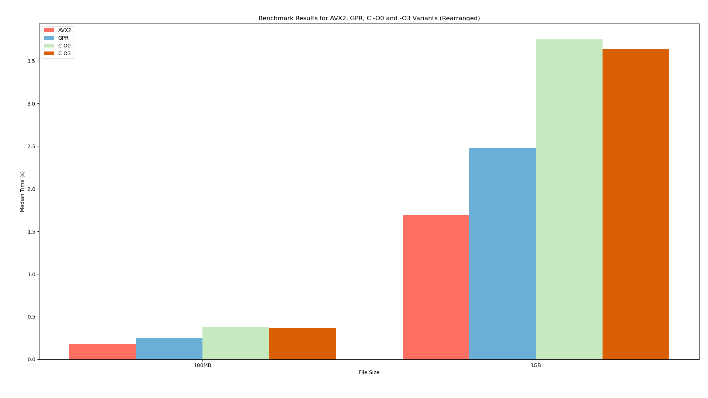

  

# XorCrypt-Asm

  

This program XORs an input file with a key and writes it into an output file, on Linux x64 architecture.

  
  

## Usage

  

Ensure you have an assembler like `nasm` and a linker like `ld` installed and you're running an x64 Linux machine. Virtualbox VM is tested and works too, but there are some problems which are explained below.

  

```bash

make && \

./xorcrypt  data.dat  key.bin  data.out

```

`make` builds every variant from the same sources:

| Binary | What it is |
|---|---|
| `xorcrypt` / `xorcrypt_avx2` | Assembly, AVX2 YMM version (default) |
| `xorcrypt_gpr` | Assembly, byte-by-byte version (`nasm -DUSE_GPR`) |
| `xorcrypt_noxor` | Assembly, reads and writes the files without XOR-ing (`nasm -DNO_XOR`), the I/O baseline for the benchmark |
| `xorcrypt_C_O0` | `xorcrypt.c` with `gcc -O0` |
| `xorcrypt_C_O3` | `xorcrypt.c` with `gcc -O3 -march=native` |
| `xorcrypt_C_keydef` | `xorcrypt_keydef.c`, key size fixed at compile time with `#define KEY_SIZE` (default 32, change with `make KEY_SIZE=64`). The key file must be exactly `KEY_SIZE` bytes |

  

## How it works

  

The program can be used in 2 modes:

- Byte-by-byte XOR-ing basis

- AVX2 256 bits YMM operations

  

Both versions wrap the key around the data if the key is smaller than the data file, and both work with files of any size.

  

The YMM version XORs 32 bytes at a time with `vmovdqa`/`vpxor`. The leftover bytes at the end of a file that doesn't divide by 32 are XORed one by one. The vector loop needs the key length to be a multiple of 32 bytes; for other key lengths it falls back to the byte-by-byte loop.

  

The memory is dynamically allocated using mmap.

## VirtualBox VM Setup

  

To see if your VM has AVX2 enabled:

```bash

cat  /proc/cpuinfo | grep  avx

```

If AVX is enabled, it should return something. Also, make sure your CPU is new enough so it supports AVX2.

  

For me, VirtualBox didn't implement the AVX2 registers (Ryzen 7 5700X), so I had to enter these commands in CMD/Powershell, however I am **not** responsible if this messes up your environment:

* Open CMD/Powershell using admin rights

*  `bcdedit /set hypervisorlaunchtype off`

*  `DISM /Online /Disable-Feature:Microsoft-Hyper-V`

* Restart the PC and it should detect it using `cat /proc/cpuinfo | grep avx`

  

## Benchmark

### Test bench
Current results: Ryzen 7 5700X, 32GB RAM, Linux Mint 22.3 (Host OS)

Old results: Ryzen 5 5600U, 32GB RAM, Linux Mint 22 (Host OS)

### Test parameters

The benchmark is made using a python script, that will call `subprocess` for each variant of the XorCrypt: AVX2, GPR, the I/O-only baseline, and the C program compiled with `gcc -O0`, `gcc -O3` and `gcc -O3` with `#define KEY_SIZE`. Test bins are 100MB and 1GB random data from `/dev/urandom`:
```bash
dd if=/dev/urandom of=random_1GB.data bs=1M count=1000 status=progress
```
I tested 10 times for each run and picked the median time, so as not to skew the benchmark with outliers, such as caching the memory inside CPU.

`benchmark.py` generates the random test files if they are missing, checks every program's output against a reference XOR before timing it, and saves the chart to `benchmark.png`. It times the whole program (start-up, reading, XOR, writing). Compare each result with the `I/O only` bar to see how much time the XOR itself takes.

### Results

32 byte key, median of 10 runs.



| Variant | 100MB | 1GB | 1GB minus I/O only |
|---|---|---|---|
| I/O only (no XOR) | 0.098s | 1.065s | - |
| ASM AVX2 | 0.102s | 1.157s | 0.092s |
| ASM GPR | 0.137s | 1.548s | 0.483s |
| C gcc -O0 | 0.285s | 2.994s | 1.930s |
| C gcc -O3 | 0.120s | 1.354s | 0.289s |
| C gcc -O3, `KEY_SIZE` define | 0.122s | 1.349s | 0.284s |

Most of the run time is reading and writing the files: the AVX2 version is only ~9% slower than the I/O-only baseline. Looking only at the XOR part (last column), AVX2 is ~5x faster than GPR and ~3x faster than C `-O3`, and C `-O3` is ~7x faster than `-O0` now that the loop gets vectorized. Fixing the key size at compile time with `#define KEY_SIZE` made no measurable difference.

The 100MB times are too close to the I/O baseline to compare the XOR part reliably.

### Old results (invalid)

The results below were measured with bugs that made the comparison unfair:

* The AVX2 loop advanced by `0x100` (256 **bytes**) instead of `0x20` (256 bits = 32 bytes), so it only XORed 1/8 of the file. Its time was essentially the I/O time.
* The C loop used `key_buffer[i % key_size]`, a 64-bit division per byte that also stops gcc from vectorizing. That is why `-O0` and `-O3` were almost the same. The C code now walks the data in key-sized blocks.
* The outputs were never checked, so the wrong AVX2 output went unnoticed.

#### Benchmark of only xorcrypt with assembly


Median times 100MB:
* AVX2 - 0.17s
* GPR - 0.24s

Median times 1GB:
* AVX2 - 1.63s
* GPR - 2.42s

#### Benchmark of all variants, including C programs



Median times 100MB:
* AVX2 - 0.175s
* GPR - 0.249s
* C gcc -O3 - 0.368s
* C gcc -O0 - 0.380s
 
Median times 1GB:
* AVX2 - 1.691s
* GPR - 2.472s
* C gcc -O3 - 3.750s
* C gcc -O0 - 3.635s

I tested with and without writing to the disk - when just the XOR was performed, without actual writing, the tests were similar, no difference was shown, so some optimizations may have been run by the OS/CPU.
